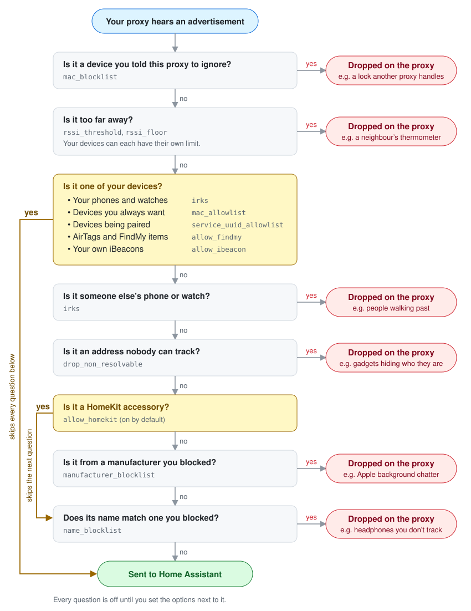

# esphome-ble-advert-filter

[](https://github.com/davidcoulson/esphome-ble-advert-filter/actions/workflows/tests.yml)
[](https://github.com/davidcoulson/esphome-ble-advert-filter/actions/workflows/compile.yml)

Filter Bluetooth advertisements on your ESPHome Bluetooth proxies, so the ones you don't care
about never get sent to Home Assistant.

A Bluetooth proxy forwards everything it hears: your neighbours' phones, people walking past,
earbuds, and a constant stream of Apple "Continuity" chatter that no integration uses. Home
Assistant throws most of it away. With a handful of proxies that's a lot of Wi-Fi traffic and
CPU spent on nothing. This component drops that traffic on the proxy itself.

On one of my proxies it drops about 6,200 adverts a minute and forwards 4,000, so 60% of what
the proxy heard never leaves it.

## Do you need this?

Probably, if you:

- run several proxies, or live somewhere busy (apartments, a street with foot traffic)
- use room tracking like [Bermuda](https://github.com/agittins/bermuda) or the
  [Private BLE Device](https://www.home-assistant.io/integrations/private_ble_device/)
  integration
- have proxies on Wi-Fi that struggle, drop off, or show high loop times

Probably not, if you have one proxy and a few BLE sensors. It won't hurt, but you won't
notice much.

## What it can do

- Drop weak signals from devices too far away to matter.
- Keep your own phones and watches but drop everyone else's, using their IRKs
  (see [Getting your IRKs](docs/irks.md)).
- Block by manufacturer or device name, for example all of Apple's background noise, while
  still letting HomeKit accessories, AirTags and iBeacons through if you want them.
- Always pass specific devices by MAC address, or have one proxy ignore a device entirely.
- Keep pairing working for Matter and Improv while the filter is on.
- Show what it's doing with sensors in Home Assistant, and let you adjust the main threshold
  from Home Assistant without reflashing.

Each advert the proxy hears goes through these questions. Any you haven't configured are
skipped.

<p align="center">
  
</p>

## Requirements

- ESPHome **2026.10.0 or newer**. It plugs into a filter hook that `bluetooth_proxy` gained in
  2026.10, so it won't build on 2026.9 or earlier.
- A working `bluetooth_proxy`. Nothing to install on the Home Assistant side.

The filter itself has been running on 60+ ESP32 proxies (S3, C3, C5, C6 and Ethernet boards)
in my house. This packaging of it is compile-tested on ESP32-C3 and ESP32-S3 against every
ESPHome release.

## Install

Add this to a proxy's YAML and flash it:

```yaml
external_components:
  - source:
      type: git
      url: https://github.com/davidcoulson/esphome-ble-advert-filter
      ref: v2.0.0
    components: [ble_advert_filter]

bluetooth_proxy:
  active: true

ble_advert_filter:
  rssi_threshold: -80
```

That alone drops anything weaker than -80 dBm. Every option is off by default, so with no
options the proxy behaves exactly as it did before.

## Example configs

Pick the one closest to what you want. Every option is described in
[docs/options.md](docs/options.md).

### Just cut the noise

No setup beyond the YAML. Nothing here looks at who a device is, only how far away it is and
whether its address can be tracked at all.

```yaml
ble_advert_filter:
  rssi_threshold: -80        # drop anything weaker than this
  rssi_floor: -90            # nothing at all below this, even allowlisted devices
  drop_non_resolvable: true  # drop addresses that can never be tracked by anyone
```

`drop_non_resolvable` drops adverts from addresses that change constantly and say nothing about
who sent them. That's mostly noise, but a few things you might track use them, such as some
beacon apps on Android phones. If something you track disappears, turn it off or add the
device to `mac_allowlist`, `allow_ibeacon` or `service_uuid_allowlist`.

### Room tracking with your own phones

For Bermuda or Private BLE Device. You need the IRK of each phone and watch you track; the
[IRK guide](docs/irks.md) shows how to get them in a few minutes.

```yaml
ble_advert_filter:
  rssi_threshold: -80
  rssi_floor: -90
  drop_non_resolvable: true
  irks:                      # your phones and watches; everyone else's are dropped
    - !secret irk_my_phone
    - !secret irk_my_watch
  manufacturer_blocklist:
    - 0x004C                 # Apple background traffic (devices matched by your IRKs still pass)
  allow_findmy: true         # keep AirTags and AirPods, if you track them
  service_uuid_allowlist:    # keep pairing working
    - 0xFFF6                                   # Matter
    - "00467768-6228-2272-4663-277478268000"   # Improv Wi-Fi
```

Blocking Apple doesn't affect a device matched by one of your IRKs, and HomeKit accessories are
let through by default. It does catch every iBeacon, because iBeacons use Apple's ID even when an
Android phone sends them. If you track a phone through the Home Assistant app's BLE transmitter
(an iBeacon), let your beacon through by its UUID:

```yaml
  allow_ibeacon:
    - uuid: "your-beacon-uuid"   # from the app's BLE transmitter settings
```

### A proxy for one or two devices

Forward only the devices you list, and nothing else.

```yaml
ble_advert_filter:
  mac_allowlist:
    - "A4:C1:38:12:34:56"    # a thermometer
  allowlist_exclusive: true
```

## Check that it's working

The proxy's log lists every active setting at boot, under `BLE Advertisement Filter:`.

To watch it from Home Assistant, add the sensors you want and, optionally, a dial for the
threshold:

```yaml
sensor:
  - platform: ble_advert_filter
    forwarded:
      name: "BLE Adverts Forwarded"
    dropped:
      name: "BLE Adverts Dropped"
    drop_rate:
      name: "BLE Advert Drop Rate"
    irk_count:
      name: "BLE IRKs Loaded"

number:
  - platform: ble_advert_filter
    rssi_threshold:
      name: "BLE RSSI Threshold"
```

Rates are in adverts per minute. There are more counters (for example how many adverts matched
one of your IRKs); see [docs/options.md](docs/options.md#sensors).

## FAQ

**Will Home Assistant still discover new devices?**
Yes, as long as their adverts pass the filter. A new device that is far from every proxy, or
that pairs from a random address while `drop_non_resolvable` or `irks` is on, may need to be
closer, or its service UUID in `service_uuid_allowlist`. Matter and Improv are covered by the
example above.

**Will HomeKit still work if I block Apple?**
Yes. HomeKit accessories are exempt by default (`allow_homekit: true`).

**My phone stopped being tracked.**
Phones get a new IRK when they're erased or restored from backup. Capture it again and update
the list. The `forwarded_irk` sensor going flat while you're home is the giveaway.

**Can I change IRKs without reflashing every proxy?**
Yes. Keep the list in Home Assistant and every proxy picks up changes. See
[Loading IRKs from Home Assistant](docs/irks.md#loading-irks-from-home-assistant).

**How much CPU and memory does it use?**
Very little. Most checks are a few comparisons. Matching an address against your IRKs is the
expensive part, and the result is cached, so each address is checked once rather than every
time it's heard. The cache is 512 bytes and only exists if you use IRKs.

**Does it work on non-ESP32 proxies?**
It plugs into `bluetooth_proxy` itself, so it should work wherever that runs, but I've only
tested ESP32.

**I'm using the older `esphome-bluetooth-proxy-filter` fork.**
Same options, same behaviour. See [docs/migrating.md](docs/migrating.md); it's a few lines of
YAML once you're on ESPHome 2026.10.

## More documentation

- [All options, sensors, the number and actions](docs/options.md)
- [Getting your IRKs](docs/irks.md)
- [How the filter decides, and tuning tips](docs/advanced.md)
- [Migrating from esphome-bluetooth-proxy-filter](docs/migrating.md)

## License

[MIT](LICENSE). Built with help from Claude (Anthropic's AI).
